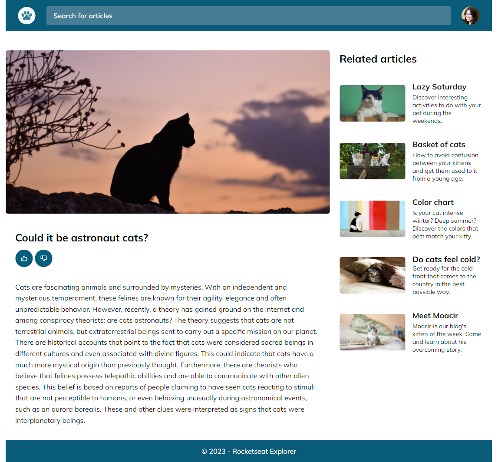

<h1 align="center"> 😻 Cats Blog  😻 </h1>

## 💻 Project

In stage 03, concepts of Grid in HTML and CSS were covered, from the Explorar Rocketseat program.

In this challenge, we created a website based on a pre-designed layout in Figma, aiming to reinforce some of the learned concepts.

- Flexbox;
- Grid columns;
- Responsive design;
- Gap.

## 🚀 Technologies Used:

  
  

## 🔖 Layout

You can preview the project layout through [FROM THIS LINK](https://www.figma.com/community/file/1256354927622258124). It is necessary to have a Figma account to access it.

## 📝 Licença

his project is under the [MIT]() license. See the LICENSE file for more details.

## 🔎 My LinkedIn

<h3 align="center">Developed by Arthur Lacerda ☕</h3>
